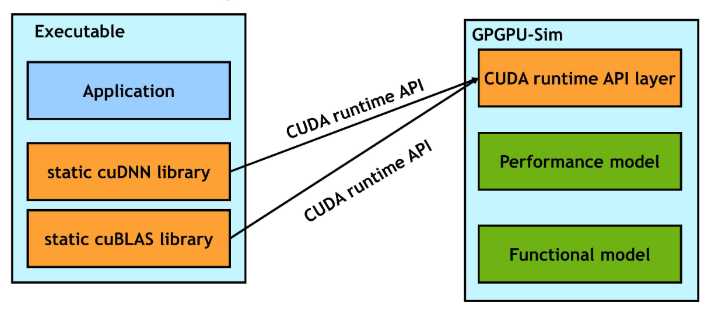
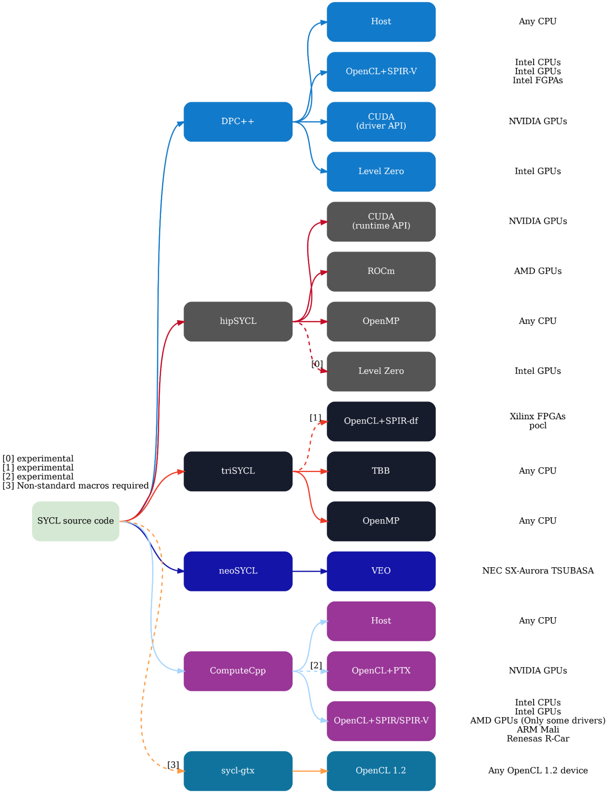
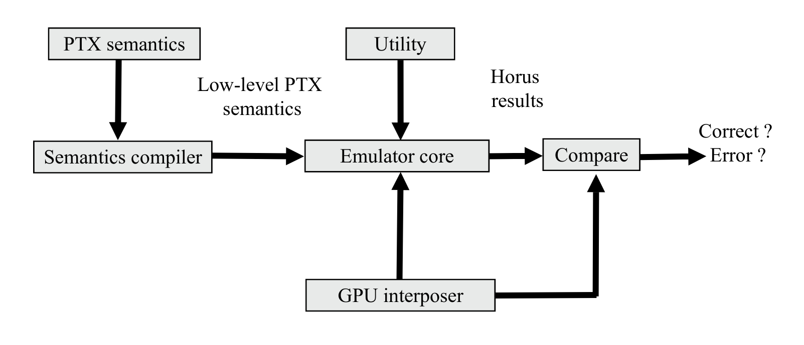

# Final Report for "Enable CUDA builds on CI"

## Overview

### Description

Student: [Hang Yan][ueqri]

Mentors: [Aaryaman Vasishta][jammm], [Lars Glud][larshg], [Haritha Jayasinghe][haritha-j]

### Background

The increasing parallelism brought by CUDA and GPU libraries benefits PCL as well as other open-source communities greatly. However, the test for these GPU-accelerated code is a bit awkward on those common CI without free GPU. Therefore, building a generic tool to allow CPU to run CUDA without a GPU is inspiring and valuable. And integrating this tool into the CI of PCL will bring more convenience and confidence to CI build.

### Deliverables

- A pipeline based on AMD HIP Toolkits, which allows CPU to run CUDA codes
- Improved CI build which enables multiple pipeline with better extendibility
- Investigation on various possibilities and test those methods

### Benefits to Community

Although there is still no complete solution of enabling CUDA build on CI to run GPU unit tests given for PCL community, we implemented a simple pipeline framework based on the proposal, and also found many problems with the upstream toolkits, i.e. HIP-CPU. Throughout the project, the bugs were reported and we made an effort to fix them in PR.

In addition, we did comprehensive and relatively exhaustive investigations, tried many other approaches such as GPGPU-Sim and cloud GPU for nonprofit, and attached those possible solutions in this report.

When HIP toolkits like HIP-CPU fix those API missing problems and enhance the robustness, or any possibilities provided in Section Investigations have relevant and helpful updates, the pipeline could be reused and integrated with PCL.

## Milestones

- Build a pipeline combined HIP toolkits in a container: [GitHub Repository](https://github.com/ueqri/cuda2hipcpu) [Azure Pipeline](https://dev.azure.com/ueqri-ci/cuda2hipcpu/_build)
- [Build a script to check HIPIFY compatibility check](https://github.com/ueqri/hip-compatibility-check)
- [Enhance PCL CI for more extendibility](https://github.com/PointCloudLibrary/pcl/pull/4737)
- [Fuse PCL docker file with HIP toolkits](https://gist.github.com/ueqri/5fa9b0e5321bc32475f173ddcebccdc0)
- [Apply transformation tool to gpu folder, and get checked codebase](https://github.com/ueqri/pcl/tree/hip-perl-test)
- Raise issues in HIP-CPU repository and merged PR on pitched memory: [#23](https://github.com/ROCm-Developer-Tools/HIP-CPU/issues/23) [#25](https://github.com/ROCm-Developer-Tools/HIP-CPU/issues/25) [PR#24](https://github.com/ROCm-Developer-Tools/HIP-CPU/pull/24)
- Use gpgpu-sim for CUDA PTX assembly simulation, raised issues for bugs: [Issue in GitHub](https://github.com/gpgpu-sim/gpgpu-sim_distribution/issues/230) [Discussion in Google Group](https://groups.google.com/g/accel-sim/c/SxtFMYrshXg/m/pTYTsZesAQAJ)

## Works Followed by Proposal

After diving into the HIP toolkits including HIPIFY and HIP-CPU header-only library, I combined them into an integrated environment inside a [docker container](https://github.com/ueqri/cuda2hipcpu). It could transform and run those traditional CUDA codes on the CPU side(including all the official tests of the HIP) by either regex or semantic replacement. [The shell script](https://github.com/ueqri/hip-compatibility-check) was also proposed to check whether certain CUDA applications are compatible for HIP porting.

However, when applying this transformation tool to the PCL codebase, exactly the gpu folder, there were lots of challenges and we did many tries through the journey.

### Try HIPIFY-Clang officially with compilation codebase

If using semantic translator based on abstract syntax tree generated by Clang, which means the assistance of the CMake build system is needed to let the compiler know enough information about the code structure, we have to dump the `COMPILE_COMMANDS` of CMake and feed them for HIPIFY-Clang.

But two ways of dumping the compile_commands, i.e. (1) using the inner variable `CMAKE_EXPORT_COMPILE_COMMANDS` to enable output of compile commands during CMake generation, (2) using tool [Bear](https://github.com/rizsotto/Bear) which especially generates a compilation database for clang tooling, totally do not support CUDA codes until writing this report.

For details about this challenge:

(1) https://cmake.org/pipermail/cmake/2018-October/068426.html

(2) https://github.com/rizsotto/Bear/pull/275 actually, it is just a test feature and does not work yet at my side.

### Try a fake layer of NVCC to work as frontend of HIP toolkits

Instead of using a compilation database for clang, the program called [fakenvcc](https://github.com/ueqri/fakenvcc/projects) was proposed, which aimed to replace the original nvcc binary with it. Some development plans can be found in [Kanban](https://github.com/ueqri/fakenvcc/projects/1), maybe not very exhaustive.

**fakenvcc** is designed as a transparent layer to do the following things:

- Port a set of CUDA codes to the HIP by hipify-clang.
- Build the HIP codes with the HIP-CPU runtime library.

Since such a fake layer knows all the *include directories* and *library dependencies* of an insulated project, the semantic transformation of hipify-clang could then be used for porting.

And another promising advantage is that there’s no need to change any CMakeLists or codes to implement the porting. It could provide huge power for automation, and what’s needed is the fake compiler binary.

But actually, during the experiment, when I pass the compile commands of NVCC, exactly those options and flags(e.g. `-I` `-l`), to hipify-clang(i.e., clang), too many errors occur due to the dialect differences. And the host/device-based overloads are the most common problems, especially in Eigen library, https://reviews.llvm.org/D77954.

This failed try resulted from semantic level, i.e., the differences of NVCC(mainly based on GCC) and Clang, please see here:

https://llvm.org/docs/CompileCudaWithLLVM.html#dialect-differences-between-clang-and-nvcc.

### Try HIPIFY-Perl for regex replacement

We have to turn back to the regex way for porting every single file, instead of using semantic parser. The process is as follows:

- First, we solved the coexistence of HIP-CPU library and Thrust library(with CPU backend), and made a minimal demonstration public. As for Thrust codes, we use OpenMP as the device backends which are supported officially according to the [documents](https://github.com/NVIDIA/thrust/blob/main/thrust/cmake/README.md#tbb--openmp).
- Then use the [official hipify-perl script](https://github.com/ROCm-Developer-Tools/HIPIFY/blob/master/bin/hipconvertinplace-perl.sh) to transform the gpu library and check the logs of code diff manually.
- Modify the CMake config, especially in `cmake/pcl_targets.cmake`, changing the functions of `PCL_ADD_LIBRARY` and `PCL_ADD_EXECUTABLE` for HIP-CPU and new Thrust bindings. Since the HIP-CPU library requires C++17 support, also add *target compile features* to C++17, only for gpu subdirectory builds.
- After these dependencies are all set, then build the GPU modules of PCL.

Although the target **pcl_gpu_containers** and **pcl_gpu_utils** are built successfully, many errors occur during the building for octree. Detailed build log is here: https://paste.ubuntu.com/p/CvrkKt3yRf/, which is based on the latest commit in [ueqri/pcl/hip-perl-test](https://github.com/ueqri/pcl/tree/hip-perl-test).

After investigation and discussion with mentors, it was concluded that:

1. Thrust library used in PCL is too old and doesn't support the non-CUDA device backends well, see here https://github.com/NVIDIA/thrust/issues/962. (OMP backend is tested pretty well in the **newest** thrust, but does not work in CUDA 10.1, which is used by PCL CI)

2. HIP toolkits can only transform those CUDA codes of high versions with relatively strict programming styles(according to the dialect differences between Clang and NVCC). For details, the higher version HIP doesn't support low version CUDA very well, i.e., some usages in old CUDA could not be implemented in HIP perfectly, such as the error about `hip::detail::Vector_type`.

3. HIP-CPU library misses lots of APIs defined in HIP-GPU, especially those warp crosslane, warp shuffle functions and special-purpose memory, probably due to the limited resources of AMD teams. Raised issues are as follows:

   https://github.com/ROCm-Developer-Tools/HIP-CPU/issues/23 

   https://github.com/ROCm-Developer-Tools/HIP-CPU/issues/25

4. Slightly differences between AMD and NVIDIA hardware, e.g. the wrap size and related warp sync functions. For our project, the warp sync functions are not supported by either HIP-GPU or HIP-CPU. Related document is here:

   https://rocmdocs.amd.com/en/latest/Programming_Guides/HIP-GUIDE.html?highlight=warp#warp-cross-lane-functions

   https://github.com/ROCm-Developer-Tools/HIP/issues/1491

### Try HIP-CPU for previous GPU octree version

From the discussion with mentors, I learned that the previous GPU octree module, exactly in [PCL 1.9.0](https://github.com/PointCloudLibrary/pcl/tree/pcl-1.9.0), uses less warp magic(e.g. warp crosslane and shuffle functions). And I turned to the [env 16.04](https://hub.docker.com/layers/pointcloudlibrary/env/16.04/images/sha256-6c4f28dafe8cbed6902ddc631fcca55649cbe9b8dd1cd5d8a2f408ab2fbc5d90?context=explore) to build the `pcl_gpu_octree` with HIP-CPU.

But in fact *the assembly embedded* in [pcl_gpu_util/device/warp.hpp](https://github.com/PointCloudLibrary/pcl/blob/pcl-1.9.0/gpu/utils/include/pcl/gpu/utils/device/warp.hpp) is also not compatible with HIP toolkits for transformation, which also block the progress of the building.

## Investigations

In this journey, I've investigated many possibilities of transforming CUDA to pure CPU runnable codes. And given the existing problems like too many APIs missing, slightly deviated hardware models between NVIDIA GPU and AMD GPU, these investigations are considered as the main parts of the project and the guideline of the further developments.

### Possibility 1: use a PTX simulator like GPGPU-Sim

[GPGPU-Sim](https://github.com/gpgpu-sim/gpgpu-sim_distribution), a cycle-level simulator modeling contemporary GPUs running GPU computing workloads written in CUDA or OpenCL. The current GPGPU-Sim supports the GPU simulation with many modern architectures like TITAN-V, QV100, and RTX2060. And it is widely used in the performance and simulation field.

As the proposal described, GPGPU-Sim supports the low-level Parallel Thread eXecution(PTX) virtual machine instruction set used in CUDA, which enables us to simulate the numerous existing, optimized CUDA applications on GPGPU-Sim. This simulator could run CUDA applications without source code modifications on Linux based platforms but does require access to the application’s source code, that is to say, use NVCC compilers to compile the source code with GPGPU-Sim fake runtime layer(exactly a shared library).

However, the purpose of this infrastructure is to generically **analyze the detailed performance** of a CUDA workload, which means it would take quite a long time to get the running finished and the metrics dumped. But, besides this performance mode, GPGPU-Sim also provides a PTX **functional simulator(emulator actually)** to execute instructions from multiple threads according to their scheduling order.

Following this [concise tutorial](https://coffeebeforearch.github.io/2020/03/30/gpgpu-sim-1.html) and [slides](https://www.osti.gov/servlets/purl/1643091), CUDA samples were built in GPGPU-Sim, and ran functional simulation successfully. But when trying some warp functions for GPGPU-Sim, the test failed.

I raised an issue, sent mail to the maintainer, and posted a discussion in the official group. Reply can be found here:

https://github.com/gpgpu-sim/gpgpu-sim_distribution/issues/230 

https://groups.google.com/g/accel-sim/c/SxtFMYrshXg/m/pTYTsZesAQAJ

Also tested the new derivative versions of GPGPU-Sim, like [Enabled Turing WMMA API](https://github.com/mayshin10/GPGPU_Sim-Enabled-Turing-WMMA-API), [UVMSmart](https://github.com/DebashisGanguly/gpgpu-sim_UVMSmart), but the correctness errors all didn’t be fixed.

#### Pros

Compared to HIPIFY and HIP-CPU, GPGPU-Sim serves as a **fake NVIDIA driver**(or PTX assembly simulator) and uses PTX generated by pure CUDA toolkits, instead of changing the compiler or adding some runtime library. So we won't meet the API missing problems and would change few codes but with more simulating time as an exchange.

Besides, the scheme of GPGPU-Sim is well tested in [PyTorch(GPGPU-Sim adapted)](https://github.com/gpgpu-sim/pytorch-gpgpu-sim), [cutlass(GPGPU-Sim adapted)](https://github.com/gpgpu-sim/cutlass-gpgpu-sim), and proved to be a promising way for either simulation or emulation.

#### Cons

The PTX emulator has not been updated for a long time. Keeping it updated and functionally correct requires significant engineering effort.

Although it works very well in shared memory and other trivial implementations, the inaccurate results produced by warp crosslane and warp shuffle functions block our project.

Hence, if this tool gets fixed to be functionally correct, it would provide much power to the target of our project.

### Possibility 2: migrate GPU libraries to SYCL codes

[SYCL](https://www.khronos.org/sycl/) is a higher-level programming model to improve programming productivity on various hardware accelerators. It is a single-source domain-specific embedded language based on pure C++17, which serves as abstractions for different heterogeneous hardware, and has comparable performance to CUDA (within 5% margin) in most cases. SYCL is considered as an upgraded model and replacement of OpenCL.

Given SYCL is a programming standard, it has many implementations(e.g. Intel DPC++, ComputeCpp, hipSYCL) which target different platforms.

And what’s more preferable here is [hipSYCL](https://github.com/illuhad/hipSYCL), which is well supported for the GPUs(produced by AMD, NVIDIA, and even Intel) and any CPUs compared to other implementations. The diagram shows how they target.

The programming model of SYCL is quite similar to CUDA, which makes it much easier to migrate the application from CUDA to SYCL. Here is [a comparison and guideline for migration](https://developer.codeplay.com/products/computecpp/ce/guides/sycl-for-cuda-developers/migration). And there is a semantic-level tool called [ReSYCLator](https://www.iwocl.org/wp-content/uploads/iwocl-2019-dhpcc-tobias-stauber-resyclator-transforming-cuda-C-source-code-into-sycl.pdf) to transform CUDA code into SYCL, but without any public source codes. However, derived from OpenCL, SYCL also has many differences from CUDA, for example, [the CUDA crosslane v.s. OpenCL sub-groups](https://intel.github.io/llvm-docs/cuda/opencl-subgroup-vs-cuda-crosslane-op.html)(from Intel oneAPI for SYCL).

#### Pros

SYCL, especially hipSYCL, supports compiling source files into a single binary that can run on all these backends when building against appropriate clang distributions. It would be a potential way to distribute PCL GPU libraries or other heterogeneous applications into almost all backends without too much effort on hardware adaptations.

#### Cons

The optimization of the octree GPU module is firmly based on the warp magic of CUDA, which makes it hard to migrate from CUDA to SYCL, since sub-groups, the equivalence of warp in SYCL, could not do those crosslane and shuffle magic in CUDA programming.

For a well-developed module like the PCL GPU library, rewriting the CUDA module and migrating it to SYCL requires the deep expertise of the mechanics and a long time of hard work. Maybe we would only move those CUDA modules bit by bit in our further developments.

### Possibility 3: run on real hardware from nonprofit program of cloud vendors

Apart from those heterogeneous languages or CUDA emulators, accessing real hardware is the most direct and robust way to run the unit test of GPU modules. But compared to CPU virtual machines, the GPU resources are scarce and need to charge. In other words, there are no free tiers of GPU for **sustained use** in almost all the online cloud vendors(e.g., GCP, AWS, Azure).

We did a deep investigation about the GPU resources across the cloud vendors. Here is also a reference list of the detailed cloud GPU information: https://github.com/zszazi/Deep-learning-in-cloud 

#### 1. Free GPU resources only for machine learning

This type of GPU resource, like [Google Colab](https://colab.research.google.com/), [Kaggle](https://www.kaggle.com/), [Gradient](https://gradient.paperspace.com/free-gpu), is all under the Python Jupyter Notebook environment to run machine learning applications. And without a free terminal to control the instance until the time of this report, it is impossible to run custom GPU programs inside.

#### 2. Free VM instance with GPU resources

GCP, AWS, and Azure are three giant cloud vendors currently. They all provide cheap GPU resources and perfect services. But what we need is the **free and sustained-use cloud GPU** to do the unit test on CI. So I compared the accounting strategy of these three vendors.

1. Google Cloud Platform

   New customers would get [$300 USD in free credits](https://cloud.google.com/free/docs/gcp-free-tier/#compute) to run, test, and deploy workloads in all GCP products, but the credits are only available on the first 90 days as the free trial.

   As for nonprofit support, [Google's free program for nonprofit organizations](https://support.google.com/nonprofits/answer/1614581?hl=en#) doesn't cover GCP. However, [for education](https://cloud.google.com/edu)(like students, faculty, researchers), Google Cloud provides much convenience to access products at no charge, but it seems not beneficial to our PCL community.

2. AWS

   It **does not** provide free GPU resources even in any form of credits or trials.

   But it provides a [credit program for nonprofits](https://aws.amazon.com/government-education/nonprofits/nonprofit-credit-program/) with \$1,000 USD per year in AWS Promotional Credit, helping to offset costs for nonprofits associated with implementing cloud-based solutions. But the register must [pay $95 USD as admin fee](https://www.techsoup.org/products/amazon-web-services-credits-for-nonprofits-g-50197-) for this program.

3. Azure

   New account would get [12 months free access to VMs plus $200 credit for 30 days](https://azure.microsoft.com/en-us/). It means the GPU resources would expire after the trial.

   But Azure gives [huge support for nonprofits](https://nonprofit.microsoft.com/en-us/getting-started). Registered organizations would get \$3,500 USD donated Azure services credit annually! It could be the **best choice** for our PCL community to access the awesome infrastructures including cloud GPU in Azure(which is currently used as PCL CI as well).

### Possibility X: discussion of some potential ways

Apart from the transformation methods(e.g. HIP-CPU, SYCL), it was found that the direct way is to use **NVIDIA PTX assembly simulation**, which can avoid modifying the original codes and CMake build system. However, the powerful tool GPGPU-Sim lacks updates nowadays. So we investigated some other emulators which were **produced recently** and able to perform NVIDIA PTX assembly simulations.

It was only found that [Horus is proposed as a GPU PTX Emulator](https://ieeexplore.ieee.org/document/9238604) written in Python in ISPASS 2020, but without any public source codes until writing this report. The introduction slide is [here](https://ispass.org/ispass2020/posters/ispass1-elhelw.pdf).

As the diagram shows, Horus dumps the CUDA binary to PTX assembly codes, feeds the PTXs to the emulator core, and emulates the assembly for exact results.

If it is proved to be robust, it would also benefit the project.

## Conclusion

In the journey of this project, although we have not achieved all the targets of the proposal, we built a pipeline framework, dug many problems from the upstream toolkits when combining them with a large-scale application, reported bugs and fixed some of them.

Furthermore, we did comprehensive investigations on the possible approaches for our project. After many experiments, several potential choices and solutions are provided, some are able to be done only after the upstream toolkits fix the problems, some are still working in progress.

- HIP-CPU solution, derived from the proposal, is able to work well only after the HIP community tackles the problems and enhances the support for warp magics.
- GPGPU-Sim solution, described in Section [Investigations](#investigations), is able to work only after correctness bugs are fixed.
- SYCL solution requires deep expertise and much effort to rewrite the GPU modules, which could be put on the agenda of PCL after discussion.
- Cloud GPU for nonprofit, working in progress, is a most promising way to solve all the problems as a completely different approach compared to CUDA transformation or simulation.

I have to say that, this journey is definitely beyond expectation with two many blocks, and without the discussion, help, and encouragement of my fantastic mentors, I couldn’t imagine how to get through these difficulties.

This is a completely roller coaster--find an approach with excitement, test it, fail with disappointment, investigate the causes with hope, no solutions just so far made slight loss, try another approach--but a really great learning experience and really worth it. Immersing myself in the experiments and investigations really broadens the horizons and ideas, incidentally polishing the skills of using tools and programming.

And I would sincerely appreciate the support of my kind mentors, they spend much time discussing my experiments and approaches and give me much guidance. And I soon realized "contribute to make it perfect and work together to go far" in the open source contribution. Not only the further development of this project, but I am also willing to contribute more on PCL and other open source communities, to be an excellent geek like my mentors and other contributors in the open source family!

Thank you for reading my final report : )

P.S. Here is a mirror report in Google Docs: [Final Report for "Enable CUDA builds on CI"](https://docs.google.com/document/d/1M6oeheNOyYMi45y8mSZUQJdYz7xR5pKYNYrPrgR4RsQ/edit?usp=sharing)
